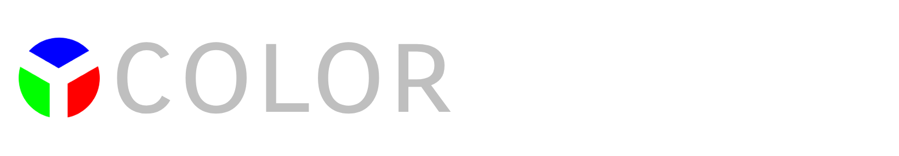

# Color Theater

Color Theater is a color grading tool for digital artists. It runs as a standalone web app, a desktop app via Electron, and as a plugin inside [Photopea](https://www.photopea.com).

**[Try it live →](https://lunalgraphics.com/about-colortheater)**

---

## Features

- **Basic Adjustments** — Brightness, contrast, saturation, sepia
- **Color Matrix** — Full 3×4 input-to-output channel matrix with offset column
- **Tint** — Soft-light color overlay with hue/saturation wheel
- **Split Toning** — Independent color toning for highlights and shadows via color-dodge/burn
- **Vignette** — Radial gradient edge darkening with blending mode control
- **Presets** — Built-in named looks (Golden Hour, Gotham, Monet, etc.) with hover-preview; import/export as `.ctpreset.json`
- **LUT Export** — Export your grade as a `.cube` (industry-standard) or `.icc` (ICC DeviceLink) file at 17, 33, or 65 grid size
- **Undo/Redo** — Full history with `Ctrl+Z` / `Ctrl+Shift+Z`
- **Photopea integration** — Opens the active document directly from Photopea; exports the grade back as a Color Lookup adjustment layer with an embedded ICC LUT and metadata

---

## Getting Started

### Requirements

- [Node.js](https://nodejs.org) 18+
- npm 9+

### Install

```bash
git clone https://github.com/lunalgraphics/colortheater.git
cd colortheater
npm install
```

### Run in development

```bash
npm run dev
```

Opens at `http://localhost:5173`.

### Build for web

```bash
npm run build
```

Output goes to `dist/`. The CI workflow automatically deploys this to GitHub Pages on every push to `master`.

### Build for Electron (desktop)

```bash
npm run build:electron
cd electron-app
npm install
npm run build          # builds for all platforms
npm run build:win32    # Windows only
npm run build:darwin   # macOS only
npm run build:linux    # Linux only
```

The Vite build targets `electron-app/app/` when `VITE_PLATFORM=electron`. Electron Builder packages it as a portable `.exe` (Windows), `.zip` (macOS), or `.deb` (Linux).

### Test the Photopea plugin locally

```bash
npm run dev:photopea
```

---

## Project Structure

```
src/
├── App.svelte                      # Root component — layout, image loading, export
├── app.css                         # Global styles and CSS layout
├── lib/
│   ├── state.svelte.js             # Global reactive state (gradeState)
│   ├── history.svelte.js           # Undo/redo history
│   ├── renderEngine/
│   │   ├── index.js                # Main Canvas/WebGL render pipeline
│   │   └── createVignetteBuffer.js # Offscreen vignette gradient renderer
│   ├── utils/
│   │   ├── color.js                # Color class (RGB ↔ HSL ↔ HSB ↔ hex)
│   │   ├── builtInPresets.js       # Built-in presets + import/export logic
│   │   ├── LutUtils.js             # .cube and ICC LUT generation
│   │   └── photopeaScripts.js      # Photopea Action Manager integration
│   ├── components/
│   │   ├── ControlPanel.svelte     # Resizable sidebar wrapper
│   │   ├── HueSatWheel.svelte      # Circular hue/saturation picker
│   │   ├── Slider.svelte           # Custom slider (horizontal/vertical)
│   │   └── controls/
│   │       ├── BasicControls.svelte
│   │       ├── MatrixControls.svelte
│   │       ├── TintControls.svelte
│   │       ├── SplitToningControls.svelte
│   │       ├── VignetteControls.svelte
│   │       └── PresetControls.svelte
│   └── svelte-attachments/
│       ├── scrollWheelValue.svelte.js  # Scroll-wheel increment for number inputs
│       └── dragwheelValue.svelte.js    # Click-drag scrub for number inputs
electron-app/
├── main.js                         # Electron main process
└── package.json                    # Electron app metadata and build config
```

---

## Architecture Overview

### State

All grading parameters live in a single Svelte 5 `$state` object exported from `state.svelte.js`. Values are stored in "display units" (percentages, hex strings) and converted to rendering units only inside `renderEngine`.

### Render Pipeline

`renderEngine(canvas, image, state)` draws to a `<canvas>` element in five sequential passes:

1. **Basic adjustments** — CSS `filter` (brightness, contrast, saturate, sepia) via `ctx.filter`
2. **Color matrix** — WebGL fragment shader applied via a persistent singleton GL context
3. **Tint** — `soft-light` composite fill
4. **Split toning** — `color-dodge` fill for highlights, `color-burn` + invert for shadows
5. **Vignette** — Radial gradient blitted with the chosen blend mode

Because the render function accepts any state-shaped object, LUT generation works by running `renderEngine` over a synthetic identity-color strip and reading back the output pixels.

### Preset Format

Presets are JSON objects with `version: 2`. The legacy `.ctxml` format from older versions is still supported on import. New presets should use the JSON format.

---

## License

MIT — see [LICENSE](LICENSE).
